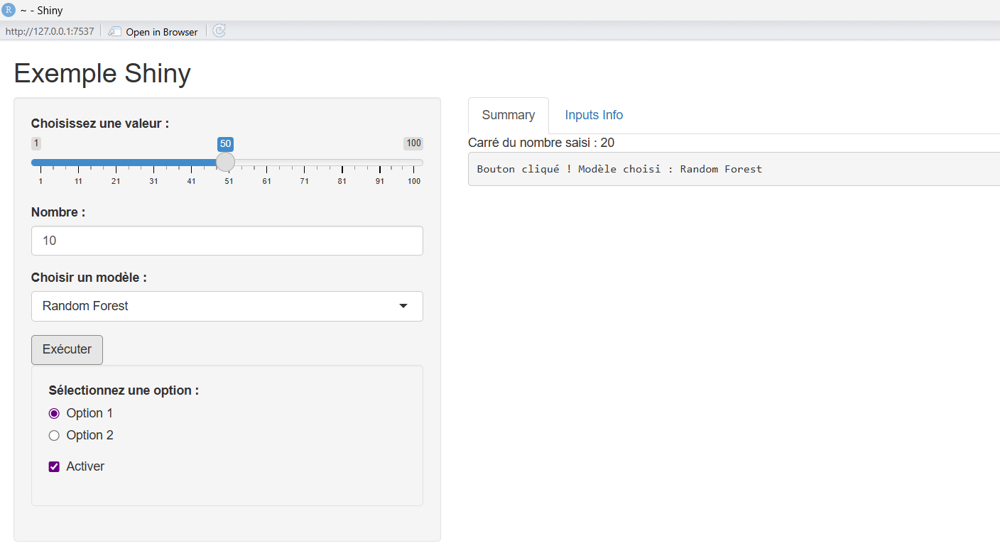
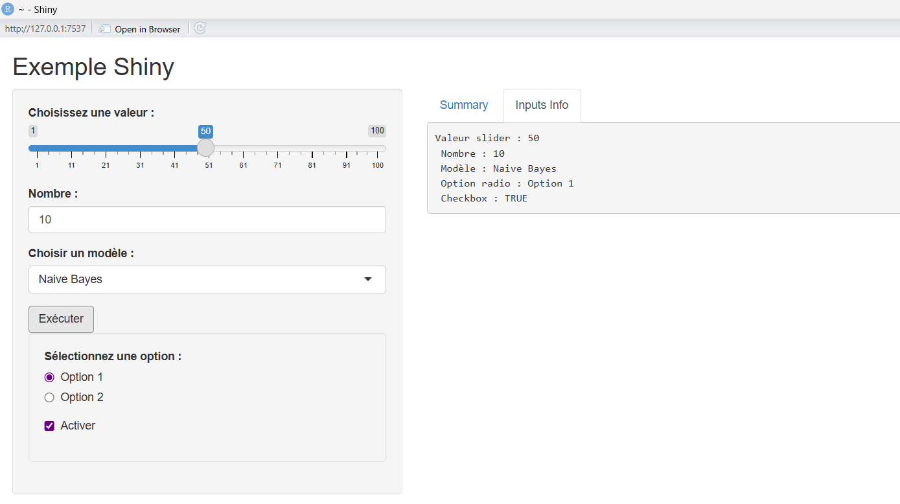

# Projet R-Shiny - Tableau de Bord Interactif

Une application Shiny simple permettant à l'utilisateur d'interagir avec divers widgets (sliders, inputs numériques, sélecteurs) et de voir les mises à jour réactives en temps réel.

## Description du Code

L'application est structurée en deux parties principales :

1.  **Interface Utilisateur (UI)** :
    *   Utilise `sidebarLayout` pour une mise en page classique (barre latérale + panneau principal).
    *   **Sidebar** : Contient tous les contrôles (slider, champ numérique, menu déroulant, etc.).
    *   **Main Panel** : Affiche les résultats dans des onglets (`tabsetPanel`), incluant des résumés textuels et les valeurs des inputs.

2.  **Serveur (Server)** :
    *   **Réactivité (`reactive`)** : Calcule automatiquement le carré du nombre saisi dès que l'entrée change.
    *   **Observateur (`observeEvent`)** : Déclenche une action spécifique (affichage d'un message) uniquement lors du clic sur le bouton "Exécuter".
    *   **Rendu (`renderText`)** : Met à jour dynamiquement l'affichage du texte dans l'interface.

## Aperçu de l'Application

### Interface Principale
Vue d'ensemble de l'application avec la barre latérale et les résultats.

### Détails des Entrées
Visualisation des différents types d'entrées disponibles pour l'utilisateur.

## Comment exécuter le projet

1.  Ouvrez `app.R` dans RStudio.
2.  Assurez-vous que le package `shiny` est installé.
3.  Cliquez sur le bouton **"Run App"** en haut de l'éditeur ou exécutez `shiny::runApp()`.
